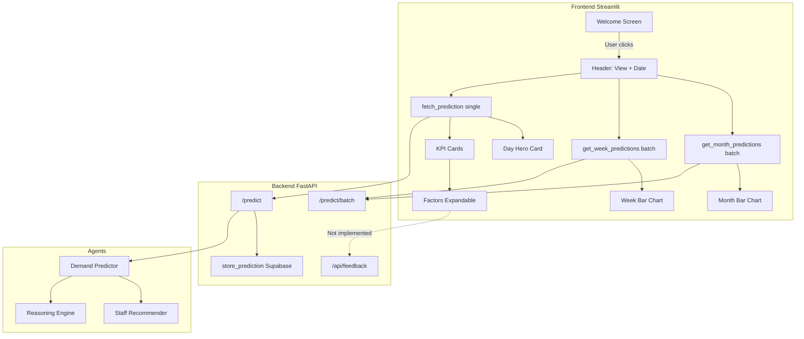

# Analyse Expert du Projet Aetherix

> Document généré pour appel et utilisation ultérieure.  
> Référence : `aetherix_project_analysis_1bf28d3a.plan.md`

---

## Contexte du projet

**Aetherix** est une couche d'intelligence PMS-agnostic pour la prévision opérationnelle (staffing, covers, F&B) en hôtellerie. L'agent combine RAG (Qdrant + Mistral), Claude pour le raisonnement, et vise une livraison "ambient" (WhatsApp, Slack, dashboard).

**État actuel:** Phase 3 MVP en cours. Dashboard Streamlit live sur [aetherix.streamlit.app](https://aetherix.streamlit.app/), API sur HuggingFace Spaces.

---

## 1. Architecture

### Points forts

- **Séparation nette:** Backend FastAPI, frontend Streamlit, agents modulaires (`demand_predictor`, `reasoning_engine`, `staff_recommender`).
- **RAG bien pensé:** Qdrant + Mistral embeddings, 495 patterns historiques dérivés de Kaggle.
- **Couche sémantique prévue:** Adapters PMS-agnostics (Mews, Opera, Apaleo) décrits dans [docs/ARCHITECTURE.md](ARCHITECTURE.md).
- **API batch:** `/predict/batch` pour la semaine/mois, évite 7 à 31 appels séquentiels.
- **Multi-tenant prévu:** `restaurant_profiles` Supabase, IDs cohérents (`hotel_main`, `pool_bar`, etc.).

### Problèmes identifiés

| Problème | Impact | Fichiers concernés |
|----------|--------|--------------------|
| **coordinator.py vide** | Pas d'orchestration centralisée, flux ad hoc dans `main.py` | `backend/agents/coordinator.py` |
| **Incohérence noms de tables** | `restaurant_profile` vs `restaurant_profiles` entre routes et restaurant_profile_routes | Plusieurs fichiers API |
| **Docker compose vs Dockerfile root** | Dockerfile root backend (7860) vs docker-compose 8000; frontend séparé | `Dockerfile`, `docker-compose.yml` |
| **Pas de rate limiting** | Risque d'abus sur `/predict` (coûts Claude/Qdrant) | `backend/main.py` |
| **Cache prédictions côté frontend uniquement** | Pas de Redis/cache backend; coûts API répétés | `frontend/views/forecast_view.py` |

### Recommandations architecture

1. **Implémenter le coordinator:** Centraliser la logique de routage, validation et orchestration des agents au lieu de tout faire dans `main.py`.
2. **Unifier le schéma Supabase:** Un seul nom de table (`restaurant_profiles`) et une migration consolidée.
3. **Rate limiting:** Ajouter `slowapi` ou middleware FastAPI (ex. 60 req/min par IP sur `/predict`).
4. **Cache backend:** Redis ou in-memory pour les prédictions identiques (date + restaurant + service), TTL 5 min.
5. **Batch API optimisé:** Le batch appelle `create_prediction` en séquence; envisager du parallélisme (`asyncio.gather`) pour réduire la latence.

---

## 2. Stack technique

### Frontend: Streamlit vs Next.js

**Doc:** ARCHITECTURE.md prévoit Next.js 14 + shadcn/ui; l'implémentation actuelle est Streamlit.

| Aspect | Streamlit actuel | Next.js prévu |
|--------|------------------|---------------|
| Temps de dev | Rapide | Plus long |
| UX / fluidité | Re-run complet, pas de SPA | SPA, transitions |
| Voice / Command Palette | Limités | Plus adaptés |
| Portfolio / démo | Correct | Plus professionnel |
| Mobile | Moyen | Meilleur (responsive) |

**Recommandation:** Garder Streamlit pour le MVP; planifier la migration Next.js en Phase 4 ou 5, en commençant par un design system partagé (tokens CSS, composants).

### Backend

- **FastAPI + Python 3.11:** Adapté pour l'IA et les APIs.
- **Supabase:** Bon choix pour PostgreSQL managé.
- **Qdrant Cloud:** Adapté pour le RAG.
- **Pas de Redis en prod:** WARP.md et ARCHITECTURE.md parlent de Redis (sessions, cache), mais il n'y a pas d'intégration dans le code. À ajouter pour la mise en production.

### Déploiement

- **HuggingFace Spaces (Docker):** Backend et frontend séparés sur HF Spaces.
- **docker-compose:** Port 8000 (backend) vs 7860 (Dockerfile) — documenter clairement pour éviter les confusions.
- **CORS:** Déjà configuré pour localhost:8501 (Streamlit).

---

## 3. UX / Product

### Points forts

- **Écran d'accueil:** Évite les appels API inutiles tant qu'aucune action n'est faite.
- **Vues jour / semaine / mois:** Correspond aux workflows typiques des managers.
- **Loading steps:** Rendu des étapes (RAG, patterns, etc.) améliore la perception de transparence.
- **Boucle feedback:** Endpoints `/feedback`, `/accuracy/summary` prévus; UI partiellement en place (expandable Factors).
- **i18n:** `en.json` / `fr.json` pour la traduction.

### Problèmes UX

| Problème | Localisation | Recommandation |
|----------|--------------|----------------|
| **Welcome screen non traduit** | `forecast_view.py` L164–205 | Utiliser `get_text("welcome.title", lang)` |
| **Écran History vide** | `history_view.py` | Afficher liste de prédictions récentes + lien accuracy |
| **Factors panel en placeholder** | `forecast_view.py` L306–360 | Afficher vraies données reasoning; retirer "will appear when integrated" quand API les fournit |
| **Feedback panel non implémenté** | `forecast_view.py` L363 | Priorité Phase 3: boutons Approve/Reject/Adjust + POST `/feedback` |
| **Pas d'erreur explicite si API down** | `fetch_prediction`, `get_week_predictions` | Message clair + CTA (réessayer, vérifier connexion) |
| **Cache invalidation** | Changer restaurant/service ne vide pas `prediction_cache` | Invalider le cache quand `restaurant` ou `service` change |
| **Month view très lente** | 28–31 appels via batch | Vérifier timeout 120s; pagination ou chargement progressif |

### Recommandations produit

1. **Feedback panel (Phase 3):** Implémenter Pre-service (accurate/higher/lower) + Post-service (actual covers) avec POST `/api/feedback`.
2. **History minimal:** Liste des 10 dernières prédictions + résumé accuracy.
3. **Onboarding:** Tooltip ou modal "First time? Select a date and click Show Forecast".
4. **Empty states:** Messages spécifiques par vue ("No data for this week" vs "API unavailable").

---

## 4. UI / Design

### Design system

Le fichier `frontend/config.py` définit un design system cohérent : couleurs (#1B4332, #2D6A4F), police Inter, KPI cards, sidebar.

### Problèmes UI

| Problème | Détail | Recommandation |
|----------|--------|----------------|
| **Day hero non traduit** | "expected covers", "Range", "Confidence" en dur | Passer par `get_text` |
| **KPI week/month en anglais** | "TOTAL WEEK", "DAILY AVG", "PEAK DAY" | Extraire dans `locales/en.json`, `fr.json` |
| **Sidebar "Restaurant", "Service" en dur** | `sidebar.py` L104–108 | Utiliser `get_text("sidebar.restaurant", lang)` |
| **Boutons "← Previous" / "Next →"** | En dur | Traduire |
| **st.html vs st.markdown** | `render_day_hero` utilise `st.html` (Streamlit 1.53+) | Vérifier compatibilité version déployée |
| **Accessibilité** | Pas d'attributs ARIA, contraste non vérifié | Vérifier WCAG 2.1 AA |
| **Mobile** | Layout wide, colonnes fixes | Breakpoints ou mode narrow |

### Recommandations UI

1. **Centraliser les traductions:** Tous les textes dans `en.json` / `fr.json`.
2. **Mode sombre (optionnel):** Variables CSS pour dark mode.
3. **Micro-interactions:** Animation légère sur KPI cards; indicateur de chargement plus visible.
4. **Figma reference:** Aligner avec le design system actuel.

---

## 5. Code Quality & Maintenabilité

### Problèmes

| Problème | Exemple | Recommandation |
|----------|---------|----------------|
| **Duplication restaurant_map** | `_restaurant_to_id` dans `timeline_chart.py` et `forecast_view.py` | Centraliser dans `config.py` ou `constants.py` |
| **Gestion d'erreurs générique** | `except Exception: pass` dans `get_week_predictions` | Logger + message utilisateur clair |
| **Magic numbers** | Timeout 60, 90, 120 | Constantes `PREDICT_TIMEOUT`, `BATCH_TIMEOUT` |
| **Tests** | `test_api.py`, `test_integration.py` présents | Couvrir `/predict` et `/predict/batch` |

---

## 6. Documentation & Cohérence

### Incohérences

- **MVP_SCOPE.md:** Voice-first, Command Palette; implémentation actuelle = dashboard-first.
- **WARP.md:** Voice-first; ARCHITECTURE.md : "Voice-available (opt-in)".
- **README:** "Dashboard: Coming soon" alors que le dashboard est en ligne.
- **Phase numbering:** ARCHITECTURE Phase 0–2, ROADMAP Phase 1–5, README Phase 3.

**Recommandation:** Unifier la numérotation des phases et mettre à jour README, WARP, MVP_SCOPE.

---

## 7. Sécurité & Performance

### Sécurité

- Pas d'authentification (acceptable MVP).
- CORS configuré; restreindre en production.
- Pas de validation stricte `restaurant_id` / `service_type`.
- Clés API dans `.env` — bon usage.

### Performance

- **Batch /predict:** Jusqu'à 31 appels séquentiels; parallélisme recommandé.
- **Qdrant:** Latence < 300 ms; monitorer en production.

---

## 8. Synthèse des priorités

### P0 (Critique, court terme)

1. Implémenter le **Feedback panel** (Pre-service + Post-service) et connecter à `/api/feedback`.
2. **Invalider le cache** des prédictions quand restaurant ou service change.
3. **Traduire** welcome screen, day hero, KPI labels (EN/FR).
4. **Corriger** le fallback `get_month_predictions` : format dates batch vs `render_month_chart_from_data`.

### P1 (Important, 2–4 semaines)

5. **History view minimale** : dernières prédictions + résumé accuracy.
6. **Rate limiting** sur `/predict` et `/predict/batch`.
7. **Cache backend** (Redis ou in-memory).
8. **Centraliser** constantes (timeouts, `restaurant_map`).
9. **Améliorer gestion d'erreurs** (logs + messages utilisateur).

### P2 (Amélioration, Phase 4+)

10. **Coordinator agent** opérationnel.
11. **Batch parallèle** pour réduire latence.
12. **Migration Next.js** (ou design system partagé).
13. **Tests E2E** sur flow principal (welcome → forecast → feedback).

---

## 9. Diagramme de flux actuel

---

## Informations complémentaires utiles

1. **Logs / métriques** du dashboard en production (temps de chargement, erreurs).
2. **Feedback utilisateurs** (beta testeurs, démos).
3. **Données de coût** réelles (Claude, Qdrant, HF Spaces) par prédiction ou par mois.
4. **Compatibilité** Streamlit déployée (1.53+ pour `st.html`).
5. **État du bug IVA-29** (patterns contextuels) — résolu ou toujours présent ?
